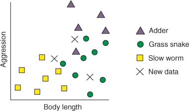
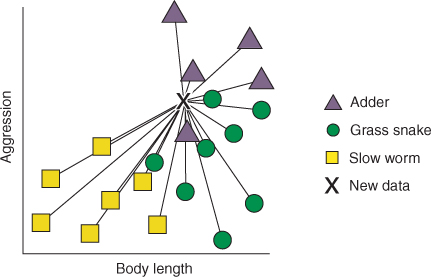
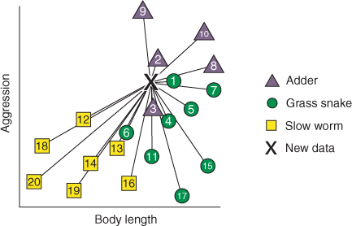
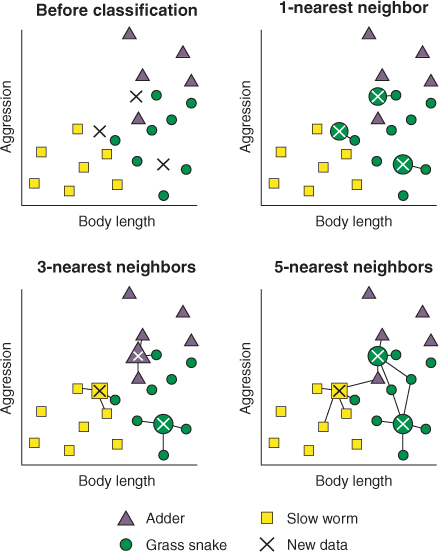

```{r setup, include=FALSE}
knitr::opts_chunk$set(echo = TRUE)

if(!require(mlr)){install.packages("mlr", dependencies = TRUE)}
if(!require(tidyverse)){install.packages("tidyverse")}
if(!require(mclust)){install.packages("mclust")}

```

### 1. What is the k-nearest neighbors (kNN) algorithm?

Some machine learning practitioners look down on kNN a little because it’s very simplistic. In fact, kNN is arguably *the* simplest machine learning algorithm, and this is one of the reasons I like it so much. In spite of its simplicity, kNN can provide surprisingly good classification performance, and its simplicity makes it easy to interpret.

#### 1.1 How does the k-nearest neighbors algorithm learn?

So how does kNN learn? Well, I’m going to use snakes to help me explain. In the UK, where—some people are surprised to learn—there are a few native species of snake. Two examples are the grass snake and the adder, which is the only venomous snake in the UK. But there is also a cute, limbless reptile called a slow worm, which is commonly mistaken for a snake.

Imagine that you work for a reptile conservation project aiming to count the numbers of grass snakes, adders, and slow worms in a woodland. Your job is to build a model that allows you to quickly classify reptiles you find into one of these three classes. When you find one of these animals, you only have enough time to rapidly estimate its length and some measure of how aggressive it is toward you, before it slithers away (funding is very scarce for your project). A reptile expert helps you manually classify the observations you’ve made so far, but you decide to build a kNN classifier to help you quickly classify future specimens you come across.

Look at the plot of data before classification in **Figure 1**. Each of our cases is plotted against body length and aggression, and the species identified by your expert is indicated by the shape of the datum. You go into the woodland again and collect data from three new specimens, which are shown by the black crosses.



**Figure 1:** Body length and aggression of reptiles. Labeled cases for adders, grass snakes, and slow worms are indicated by their shape. New, unlabeled data are shown by black crosses.

We can describe the kNN algorithm (and other machine learning algorithms) in terms of two phases:

1.  The training phase

2.  The prediction phase

The training phase of the kNN algorithm consists only of storing the data. This is unusual among machine learning algorithms, and it means that most of the computation is done during the prediction phase. During the prediction phase, the kNN algorithm calculates the *distance* between each new, unlabeled case and all the labeled cases. When I say “distance,” I mean their nearness in terms of the aggression and body-length variables, not how far away in the woods you found them! This distance metric is often called *Euclidean distance*, which in two or even three dimensions is easy to visualize in your head as the straight-line distance between two points on a plot (this distance is shown in **Figure 2**). This is calculated in as many dimensions as are present in the data.

**Figure 2:** The first step of the kNN algorithm: calculating distance. The lines represent the distance between one of the unlabeled cases (the cross) and each of the labeled cases.

Next, for each unlabeled case, the algorithm ranks the neighbors from the nearest (most similar) to the furthest (the least similar). This is shown in **Figure 3**.

**Figure 3:** The second step of the kNN algorithm: ranking the neighbors. The lines represent the distance between one of the unlabeled cases (the cross) and each of the labeled cases. The numbers represent the ranked distance between the unlabeled case (the cross) and each labeled case (1 = closest).

The algorithm identifies the *k*-labeled cases (neighbors) nearest to each unlabeled case. *k* is an integer specified by us. In other words, find the *k*-labeled cases that are most similar in terms of their variables to the unlabeled case. Finally, each of the *k*-nearest neighbor cases “votes” on which class the unlabeled data belongs in, based on the nearest neighbor’s own class. In other words, whatever class most of the *k*-nearest neighbors belong to is what the unlabeled case is classified as.

```         
NOTE: Because all of its computation is done during the prediction phase, kNN is said to be a lazy learner.
```

Let’s work through Figure 4 and see this in practice. When we set *k* to 1, the algorithm finds the single labeled case that is most similar to each of the unlabeled data items. Each of the unlabeled reptiles is closest to a member of the grass snake class, so they are all assigned to this class.

**Figure 4:** The final step of the kNN algorithm: identifying the k-nearest neighbors and taking the majority vote. Lines connect the unlabeled data with their one, three, and five nearest neighbors. The majority vote in each scenario is indicated by the shape drawn under each cross.

When we set *k* to 3, the algorithm finds the three labeled cases that are most similar to each of the unlabeled data items. As you can see in the figure, two of the unlabeled cases have nearest neighbors belonging to more than one class. In this situation, each nearest neighbor “votes” for its own class, and the majority vote wins. This is very intuitive because if a single unusually aggressive grass snake happens to be the nearest neighbor to an as-yet-unlabeled adder, it will be outvoted by the neighboring adders in the data.

Hopefully now you can see how this extends to other values of *k*. When we set *k* to 5, for example, the algorithm simply finds the five nearest cases to the unlabeled data and takes the majority vote as the class of the unlabeled case. Notice that in all three scenarios, the value of k directly impacts how each unlabeled case is classified.

```         
TIP: The kNN algorithm can actually be used for both classification and regression problems! The only difference is that instead of taking the majority class vote, the algorithm finds the mean or median of the nearest neighbors’ values.
```

#### 1.2 What happens if the vote is tied?

It may happen that all of the k-nearest neighbors belong to different classes and that the vote results in a tie. What happens in this situation? Well, one way we can avoid this in a two-class classification problem (when the data can only belong to one of two, mutually exclusive groups) is to ensure that we pick odd numbers of k. This way, there will always be a deciding vote. But what about in situations like our reptile classification problem, where we have more than two groups?

One way of dealing with this situation is to decrease *k* until a majority vote can be won. But this doesn’t help if an unlabeled case is equi-distant between its two nearest neighbors.

Instead, a more common (and pragmatic) approach is to randomly assign cases with no majority vote to one of the classes. In practice, the proportion of cases that have ties among their nearest neighbors is very small, so this has a limited impact on the classification accuracy of the model. However, if you have many ties in your data, your options are as follows:

-   Choose a different value of *k*.
-   Add a small amount of noise to the data.
-   Consider using a different algorithm!

### 2. Building your first kNN model

Imagine that you work in a hospital and are trying to improve the diagnosis of patients with diabetes. You collect diagnostic data over a few months from suspected diabetes patients and record whether they were diagnosed as healthy, chemically diabetic, or overtly diabetic. You would like to use the kNN algorithm to train a model that can predict which of these classes a new patient will belong to, so that diagnoses can be improved. This is a three-class classification problem.

#### 2.1 Loading and exploring the diabetes dataset

Now, let’s load some data built into the `mclust` package, convert it into a tibble, and explore it a little.

```{r LOAD DIABETES DATA, warning=FALSE, tidy=TRUE, tidy.opts=list(width.cutoff=80)}

data("diabetes", package = "mclust");
diabetes

diabetes <- as_tibble(diabetes);
diabetes


```

We have a tibble with 145 cases and 4 variables. The class factor shows that 76 of the cases were non-diabetic (Normal), 36 were chemically diabetic (Chemical), and 33 were overtly diabetic (Overt). The other three variables are continuous measures of the level of blood glucose and insulin after a glucose tolerance test (glucose and insulin, respectively), and the steady-state level of blood glucose (sspg).

To show how these variables are related, let's plot them against each other.

```{r PLOT THE RELATIONSHIPS IN THE DATA, warning=FALSE, tidy=TRUE, tidy.opts=list(width.cutoff=80)}

diabetes |> ggplot(aes(x = glucose, y = insulin, color = class)) +
  geom_point() +
  theme(legend.position = "bottom")

diabetes |> ggplot(aes(x = glucose, y = sspg, color = class)) +
  geom_point() +
  theme(legend.position = "bottom")

diabetes |> ggplot(aes(x = sspg, y = insulin, color = class)) +
  geom_point() +
  theme(legend.position = "bottom")

```

Looking at the data, we can see there are differences in the continuous variables among the three classes, so let’s build a kNN classifier that we can use to predict diabetes status from measurements of future patients.

Our dataset only consists of continuous predictor variables, but often we may be working with categorical predictor variables too. [The kNN algorithm can’t handle categorical variables natively]{.underline}; they need to first be encoded somehow, or distance metrics other than Euclidean distance must be used.

[It’s also very important for kNN (and many machine learning algorithms) to scale the predictor variables by dividing them by their standard deviation]{.underline}. This preserves the relationships between the variables, but ensures that variables measured on larger scales aren’t given more importance by the algorithm. In the current example, if we divided the glucose and insulin variables by 1,000,000, then predictions would rely mostly on the value of the sspg variable. [We don’t need to scale the predictors ourselves because, by default, the kNN algorithm wrapped by the `mlr` package does this for us]{.underline}.

#### 2.2 Using `mlr` to train your first kNN model

We understand the problem we’re trying to solve (classifying new patients into one of three classes), and now we need to train the kNN algorithm to build a model that will solve that problem. Building a machine learning model with the `mlr` package has three main stages:

1.  **Define the task.** The task consists of the data and what we want to do with it. In this case, the data is diabetesTib, and we want to classify the data with the class variable as the target variable.

2.  **Define the learner.** The learner is simply the name of the algorithm we plan to use, along with any additional arguments the algorithm accepts.

3.  **Train the model.** This stage is what it sounds like: you pass the task to the learner, and the learner generates a model that you can use to make future predictions.

```         
TIP: This may seem unnecessarily cumbersome, but splitting the task, learner, and model into different stages is very useful. It means we can define a single task and apply multiple learners to it, or define a single learner and test it with multiple different tasks.
```

#### 2.3 Telling `mlr` what we’re trying to achieve: Defining the task

Let’s begin by defining our task. The components needed to define a task are:

-   The data containing the predictor variables (variables we hope contain the information needed to make predictions/solve our problem).

-   The target variable we want to predict.

For supervised learning, the target variable will be categorical if we have a classification problem, and continuous if we have a regression problem. For unsupervised learning, we omit the target variable from our task definition, as we don’t have access to labeled data. The components of a task are shown in **Figure 5**.


**Figure 5:** Defining a task in `mlr`. A task definition consists of the data containing the predictor variables and, for classification and regression problems, a target variable we want to predict. For unsupervised learning, the target is omitted.

We want to build a classification model, so we use the `makeClassifTask()` function to define a classification task. When we build regression and clustering models, we’ll use `makeRegrTask()` and `makeClusterTask()`, respectively.

We supply the name of our tibble as the `data` argument and the name of the factor that contains the class labels as the `target` argument.

If we call the task, we can see it’s a classification task on the `diabetesTib` tibble, whose target is the `class` variable. We also get some information about the number of observations and the number of different types of variables (often called *features* in machine learning lingo). Some additional information includes whether we have missing data, the number of observations in each class, and which class is considered to be the “positive” class (only relevant for two-class tasks).

```{r DEFINING THE DIABETES TASK, warning=FALSE, tidy=TRUE, tidy.opts=list(width.cutoff=80)}

diabetes_task <- makeClassifTask(data = diabetes, target = "class")
diabetes_task

makeClassifTask(data = diabetes, target = "class");
```

#### 2.4 Telling `mlr` which algorithm to use: Defining the learner

Next, let’s define our learner. The components needed to define a learner are as follows:

-   The class of algorithm we are using:

    -   `"classif."` for classification

    -   `"regr."` for regression

    -   `"cluster."` for clustering

    -   `"surv."` and `"multilabel."` for predicting survival and multilabel classification, which I won’t discuss

-   The algorithm we are using

-   Any additional options we may wish to use to control the algorithm

As you’ll see, the first and second components are combined together in a single character argument to define which algorithm will be used (for example, `"classif.knn"`). The components of a learner are shown in **Figure 6**.


**Figure 6:** Defining a learner in `mlr`. A learner definition consists of the class of algorithm you want to use, the name of the individual algorithm, and, optionally, any additional arguments to control the algorithm’s behavior.

We use the `makeLearner()` function to define a learner. The first argument to the `makeLearner()` function is the algorithm that we’re going to use to train our model. In this case, we want to use the kNN algorithm, so we supply `"classif.knn"` as the argument. See how this is the class (`"classif.`) joined to the name (`knn"`) of the algorithm?

The argument `par.vals` stands for parameter values, which allows us to specify the number of k-nearest neighbors we want the algorithm to use. For now, we’ll just set this to 2, but we’ll discuss how to choose k soon:

```{r DEFINING THE KNN LEARNER, warning=FALSE, tidy=TRUE, tidy.opts=list(width.cutoff=80)}

myKnn <- makeLearner("classif.knn", par.vals = list(k = 2))
myKnn
```

#### 2.5 Putting it all together: Training the model

Now that we’ve defined our task and our learner, we can now train our model. The components needed to train a model are the learner and task we defined earlier. The whole process of defining the task and learner and combining them to train the model is shown in **Figure 7**.


**Figure 7:** Training a model in `mlr`. Training a model simply consists of combining a learner with a task.

This is achieved with the `train()` function, which takes the learner as the first argument and the task as its second argument.

```{r TRAIN THE MODEL, warning=FALSE, tidy=TRUE, tidy.opts=list(width.cutoff=80)}

# learner before task
knn_model <- mlr::train(learner = myKnn, task =  diabetes_task)
knn_model

```

We have our model, so let’s pass the data through it to see how it performs. The `predict()` function takes unlabeled data and passes it through the model to get the predicted classes. The first argument is the model, and the data being passed to it is given as the `newdata` argument.

We can pass these predictions as the first argument of the `performance()` function. This function compares the classes predicted by the model to the true classes, and returns performance metrics of how well the predicted and true values match each other. Use of the `predict()` and `performance()` functions is illustrated in **Figure 8**.


**Figure 8:** A summary of the `predict()` and `performance()` functions of `mlr.` `predict()` passes observations into a model and outputs the predicted values. `performance()` compares these predicted values to the cases’ true values and outputs one or more performance metrics summarizing the similarity between the two.

We specify which performance metrics we want the function to return by supplying them as a list to the measures argument. The two measures I’ve asked for are `mmce`, the *mean misclassification error*; and `acc`, or *accuracy*. MMCE is simply the proportion of cases classified as a class other than their true class. Accuracy is the opposite of this: the proportion of cases that were correctly classified by the model. You can see that the two sum to 1.00.

```{r TESTING PERFORMANCE ON TRAINING DATA (VERY BAD PRACTICE), warning=FALSE, tidy=TRUE, tidy.opts=list(width.cutoff=80)}

knn_predict <- predict(knn_model, newdata = diabetes);
knn_predict$data

performance(knn_predict, measures = list(mmce, acc));

```

So our model is correctly classifying 95.2% of cases! Does this mean it will perform well on new, unseen patients? The truth is that [**we don’t know**]{.underline}. Evaluating model performance by asking it to make predictions on data you used to train it in the first place tells you very little about how the model will perform when making predictions on completely unseen data. Therefore, you should never evaluate model performance this way. Before we discuss why, I want to introduce an important concept called the *bias-variance trade-off*.

### 3. Balancing two sources of model error: The bias-variance trade-off

There is a concept in machine learning that is so important, and misunderstood by so many people, that I want to take the time to explain it well: the *bias-variance trade-off*.

Let’s start with an example. A colleague sends you data about emails your company has received and asks you to build a model to classify incoming emails as junk or not junk (this is, of course, a classification problem). The dataset has 30 variables consisting of observations like the number of characters in the email, the presence of URLs, and the number of email addresses it was sent to, in addition to whether the email was junk or not.

You lazily build a classification model using only four of the predictor variables (because it’s nearly lunch and they’re serving katsu curry today). You send the model to your colleague, who implements it as the company’s junk filter. A week later, your colleague comes back to you, complaining that the junk filter is performing badly and is consistently misclassifying certain types of emails. You pass the data you used to train the model back into the model, and find it correctly classifies only 60% of the emails. You decide that you may have **underfitted** the data. In other words, your model was too simple and was *biased* toward misclassifying certain types of emails.

You go back to the data, and this time you include all 30 variables as predictors in your model. You pass the data back through your model and find that it correctly classifies 98% of the emails: an improvement, surely! You send this second model to your colleague and tell them you are certain it’s better. Another week goes by, and again, your colleague comes to you and complains that the model is performing badly: it’s misclassifying many emails, and in a somewhat unpredictable manner. You decide that you have **overfitted** the data. In other words, your model was too complex and is modeling noise in the data that you used to train it. Now, when you give new datasets to the model, there is a lot of *variance* in the predictions it gives. A model that is overfitted will perform well on the data used to train it, but poorly on new data. **Underfitting** and **overfitting** are two important sources of error in model building.

In **underfitting**, we have included too few predictors or too simple a model to adequately describe the relationships/patterns in the data. The result is a model that is said to be biased: a model that performs poorly on both the data we use to train it and on new data.

**Overfitting** is the opposite of **underfitting** and describes the situation where we include too many predictors or too complex a model, such that we are modeling not only the relationships/patterns in our data, but also the noise. Noise in a dataset is variation that is not systematically related to variables we have measured, but rather is due to inherent variability and/or error in measurement of our variables. The pattern of noise is very specific to an individual dataset, so if we start to model the noise, our model may perform very well on the data we trained it on but give quite variable results for future datasets.

**Underfitting** and **overfitting** both introduce error and reduce the generalizability of the model: the ability of the model to generalize to future, unseen data. They are also opposed to each other: somewhere between [a model that underfits and has bias, and a model that overfits and has variance]{.underline}, is an optimal model that balances the *bias-variance trade-off*; see **Figure 9**.


**Figure 9:** The bias-variance trade-off. Generalization error is the proportion of erroneous predictions a model makes and is a result of overfitting and underfitting. The error associated with overfitting (too complex a model) is variance. The error associated with underfitting (too simple a model) is bias. The error associated with overfitting (too complex a model) is variance. An optimal model balances this trade-off.

Now, look at **Figure 10**. Can you see that the underfit model poorly represents the patterns in the data, and the overfit model is too granular and models noise in the data instead of the real patterns?


**Figure 10:** Examples of underfitting, optimal fitting, and overfitting for a twoclass classification problem. The dotted line represents a decision boundary.

In the case of our kNN algorithm, selecting a small value of *k* (where only a small number of very similar cases are included in the vote) is more likely to model the noise in our data, resulting in a more complex model that is overfit and will produce a lot of variance when we use it to classify future patients. In contrast, selecting a large value of *k* (where more neighbors are included in the vote) is more likely to miss local differences in our data, resulting in a less complex model that is underfit and is biased toward misclassifying certain types of patients.

So the question you’re probably asking now is, *“How do I tell if I’m under- or overfitting?”* The answer is a technique called **cross-validation**.

### 4. Using cross-validation to tell if we’re overfitting or underfitting

In the email example, once you had trained the second, overfit model, you tried to evaluate its performance by seeing how well it classified data you had used to train it. I mentioned that this is an extremely bad idea, and here is why: [a model will almost always perform better on the data you trained it with than on new, unseen data]{.underline}. You can build a model that is extremely overfit, modeling all of the noise in the dataset, and you would never know, because passing the data back through the model gives you good predictive accuracy.

The answer is to evaluate the performance of your model on data it hasn’t seen yet. One way you could do this would be to train the model on all of the data available to you and then, over the next weeks and months, as you collect new data, pass it through your model and evaluate how the model performs. This approach is very slow and inefficient, and could make model building take years!

Instead, we typically split our data in two. We use one portion to train the model: this portion is called the *training set*. We use the remaining portion, which the algorithm never sees during training, to test the model: this portion is the *test set*. We then evaluate how close the model’s predictions on the test set are to their true values. We summarize the closeness of these predictions with *performance metrics*. Measuring how well the trained model performs on the test set helps us determine whether our model will perform well on unseen data, or whether we need to improve it further.

This process is called *cross-validation* (CV), and it is an extremely important approach in any supervised machine learning pipeline. Once we have cross-validated our model and are happy with its performance, we then use all the data we have (including the data in the test set) to train the final model (because typically, the more data we train our model with, the less bias it will have).

There are three common cross-validation approaches:

-   Holdout cross-validation

-   K-fold cross-validation

-   Leave-one-out cross-validation

#### 4.1 Holdout cross-validation

Holdout CV is the simplest method to understand: you simply “hold out” a random proportion of your data as your test set, and train your model on the remaining data. You then pass the test set through the model and calculate its performance metrics. You can see a scheme of holdout CV in **Figure 11**.


**Figure 11:** Holdout CV. The data is randomly split into a training set and test set. The training set is used to train the model, which is then used to make predictions on the test set. The similarity of the predictions to the true values of the test set is used to evaluate model performance.

When following this approach, you need to decide what proportion of the data to use as the test set. The larger the test set is, the smaller your training set will be. Here’s the confusing part: performance estimation by CV is also subject to error and the bias-variance trade-off. If your test set is too small, then the estimate of performance is going to have high variance; but if the training set is too small, then the estimate of performance is going to have high bias. A commonly used split is to use two-thirds of the data for training and the remaining one-third as a test set, but this depends on the number of cases in the data, among other things.

##### MAKING A HOLDOUT RESAMPLING DESCRIPTION

The first step when employing any CV in `mlr` is to make a resampling description, which is simply a set of instructions for how the data will be split into test and training sets. The first argument to the `makeResampleDesc()` function is the CV method we’re going to use: in this case, `"Holdout"`. For holdout CV, we need to tell the function what proportion of the data will be used as the training set, so we supply this to the `split` argument.

An additional, optional argument, stratify = TRUE, asks the function to ensure that when it splits the data into training and test sets, it tries to maintain the proportion of each class of patient in each set. This is important in classification problems like ours, where the groups are very unbalanced (we have more healthy patients than both other groups combined) because, otherwise, we could get a test set with very few of one of our smaller classes.

##### PERFORMING HOLDOUT CV

Now that we’ve defined how we’re going to cross-validate our learner, we can run the CV using the resample() function. We supply the learner and task that we created, and the resampling method we defined a moment ago, to the `resample()` function. We also ask it to give us measures of MMCE and accuracy.

The `resample()` function prints the performance measures when you run it, but you can access them by extracting the \$aggr component from the resampling object.

You’ll notice two things:

-   The accuracy of the model as estimated by holdout cross-validation is less than when we evaluated its performance on the data we used to train the full model. This exemplifies my point earlier that models will perform better on the data that trained them than on unseen data.

-   Your performance metrics will probably be different than mine. In fact, run the `resample()` function over and over again, and you’ll get a very different result each time! The reason for this *variance* is that the data is randomly split into the test and training sets. Sometimes the split is such that the model performs well on the test set; sometimes the split is such that it performs poorly.

##### CALCULATING A CONFUSION MATRIX

To get a better idea of which groups are being correctly classified and which are being misclassified, we can construct a confusion matrix. A confusion matrix is simply a tabular representation of the true and predicted class of each case in the test set.

With `mlr`, we can calculate the confusion matrix using the `calculateConfusionMatrix()` function. The first argument is the `$pred` component of our `holdoutCV` object, which contains the true and predicted classes of the test set. The optional argument `relative` asks the function to show the proportion of each class in the true and predicted class labels.

The absolute confusion matrix is easier to interpret. The rows show the true class labels, and the columns show the predicted labels. The numbers represent the number of cases in every combination of true class and predicted class. For example, in this matrix, 11 patients were correctly classified as chemically diabetic, but one was erroneously classified as healthy. Correctly classified patients are found on the diagonal of the matrix (where true class `==` predicted class).

The relative confusion matrix looks a little more intimidating, but the principal is the same. This time, instead of the number of cases for each combination of true class and predicted class, we have the proportion. The number before the `/` is the proportion of the row in this column, and the number after the `/` is the proportion of the column in this row. For example, in this matrix, 92% of chemically diabetic patients were correctly classified, while 8% were misclassified as healthy.

Confusion matrices help us understand which classes our model classifies well and which ones it does worse at classifying. For example, based on this confusion matrix, it looks like our model struggles to distinguish healthy patients from chemically diabetic ones.

As the performance metrics reported by holdout CV depend so heavily on how much of the data we use as the training and test sets, I try to avoid it unless my model is very expensive to train, so I generally prefer k-fold CV. The only real benefit of this method is that it is computationally less expensive than the other forms of CV. This can make it the only viable CV method for computationally expensive algorithms. But the purpose of CV is to get as accurate an estimation of model performance as possible, and holdout CV may give you very different results each time you apply it, because not all of the data is used in the training set and test set. This is where the other forms of CV come in.

```{r PERFORMING HOLD-OUT CROSS-VALIDATION, warning=FALSE, tidy=TRUE, tidy.opts=list(width.cutoff=80)}

holdout <- makeResampleDesc(method = "Holdout", split  = 2 / 3, stratify = T);

holdout_cv <- resample(learner = myKnn, 
         task = diabetes_task, 
         resampling = holdout,
         measure  = list(mmce, acc));
#resample == train
holdout_cv
holdout_cv$pred$data


calculateConfusionMatrix(holdout_cv$pred, relative = T)


```

#### 4.2 K-fold cross-validation

In k-fold CV, we randomly split the data into approximately equal-sized chunks called folds. Then we reserve one of the folds as a test set and use the remaining data as the training set (just like in holdout). We pass the test set through the model and make a record of the relevant performance metrics. Now, we use a different fold of the data as our test set and do the same thing. We continue until all the folds have been used once as the test set. We then get an average of the performance metric as an estimate of model performance. You can see a scheme of k-fold CV in **Figure 12**.


Figure 12: K-fold CV. The data is randomly split into near equally sized folds. Each fold is used as the test set once, with the rest of the data used as the training set. The similarity of the predictions to the true values of the test set is used to evaluate model performance.

```         
NOTE: It’s important to note that each case in the data appears in the test set only once in this procedure.
```

This approach will typically give a more accurate estimate of model performance because every case appears in the test set once, and we are averaging the estimates over many runs. But we can improve this a little by using repeated k-fold CV, where, after the previous procedure, we shuffle the data around and perform it again.

For example, a commonly chosen value of k for k-fold is 10. Again, this depends on the size of the data, among other things, but it is a reasonable value for many datasets. This means we split the data into 10 nearly equal-sized chunks and perform the CV. If we repeat this procedure 5 times, then we have 10-fold CV repeated 5 times (this is not the same as 50-fold CV), and the estimate of model performance will be the average of 50 different runs. Therefore, if you have the computational power, it is usually preferred to use repeated k-fold CV instead of ordinary k-fold.

```{r PERFORMING REPEATED K-FOLD CROSS-VALIDATION, warning=FALSE, message=FALSE, tidy=TRUE, tidy.opts=list(width.cutoff=80)}

#repeat kfold cross vardiation

k4 <- makeResampleDesc(method = "RepCV", folds = 10,rep = 50, stratify =T);

k4_CV <- resample(learner = myKnn, 
         task = diabetes_task, 
         resampling = k4,
         measure  = list(mmce, acc));

k4_CV$aggr
k4_CV$pred$data


```

We perform k-fold CV in the same way as holdout. This time, when we make our resampling description, we tell it we’re going to use repeated k-fold cross-validation (`"RepCV"`), and we tell it how many folds we want to split the data into. The default number of folds is 10, which is often a good choice, but I want to show you how you can explicitly control the splits. Next, we tell the function that we want to repeat the 10-fold CV 50 times with the reps argument. This gives us 500 performance measures to average across! Again, we ask for the classes to be stratified among the folds:

The model correctly classified 89.8% of cases on average—much lower than when we predicted the data we used to train the model! Rerun the `resample()` function a few times, and compare the average accuracy after each run. The estimate is much more stable than when we repeated holdout CV.

Your goal when cross-validating a model is to get as accurate and stable an estimate of model performance as possible. Broadly speaking, the more repeats you can do, the more accurate and stable these estimates will become. At some point, though, having more repeats won’t improve the accuracy or stability of the performance estimate.

So how do you decide how many repeats to perform? A sound approach is to choose a number of repeats that is computationally reasonable, run the process a few times, and see if the average performance estimate varies a lot. If not, great. If it does vary a lot, you should increase the number of repeats.

#### 4.3 Leave-one-out cross-validation

Leave-one-out CV can be thought of as the extreme of k-fold CV: instead of breaking the data into folds, we reserve a single observation as a test case, train the model on the whole of the rest of the data, and then pass the test case through it and record the relevant performance metrics. Next, we do the same thing but select a different observation as the test case. We continue doing this until every observation has been used once as the test case, where we take the average of the performance metrics. You can see a scheme of leave-one-out CV in **Figure 13**.


**Figure 13:** Leave-one-out CV is the extreme of k-fold, where we reserve a single case as the test set and train the model on the remaining data. The similarity of the predictions to the true values of the test set is used to evaluate model performance.

Because the test set is only a single observation, leave-one-out CV tends to give quite variable estimates of model performance (because the performance estimate ofeach iteration depends on correctly labeling that single test case). But it can give less variable estimates of model performance than k-fold when your dataset is small. When you have a small dataset, splitting it up into k folds will leave you with a very small training set. The variance of a model trained on a small dataset tends to be higher because it will be more influenced by sampling error/unusual cases. Therefore, leave-one-out CV is useful for small datasets where splitting it into k folds would give variable results. It is also computationally less expensive than repeated, k-fold CV.

```{r PERFORMING LEAVE-ONE-OUT CROSS-VALIDATION, warning=FALSE, message=FALSE, tidy=TRUE, tidy.opts=list(width.cutoff=80)}

LOO <- makeResampleDesc(method = "LOO");

LOO_CV <- resample(learner = myKnn, 
         task = diabetes_task, 
         resampling = LOO,
         measure  = list(mmce, acc));
#resample == train
LOO_CV
LOO_CV$pred$data


calculateConfusionMatrix(LOO_CV$pred, relative = T)


```

Creating a resampling description for leave-one-out is just as simple as for holdout and k-fold CV. We specify leave-one-out CV when making the resample description by supplying `LOO` as the argument to the method. Because the test set is only a single case, we obviously can’t stratify with leave-one-out. Also, because each case is used once as the test set, with all the other data used as the training set, there’s no need to repeat the procedure.

If you rerun the CV over and over again, you’ll find that for this model and data, the performance estimate is more variable than for k-fold but less variable than for the holdout we ran earlier.

So you now know how to apply three commonly used types of cross-validation! [If we’ve cross-validated our model and are happy that it will perform well enough on unseen data, then we would train the model on all of the data available to us, and use this to make future predictions]{.underline}.

### 5. Parameters and hyperparameters

Machine learning models often have *parameters* associated with them. A parameter is a variable or value that is estimated from the data and that is internal to the model and controls how it makes predictions on new data. An example of a model parameter is the slope of a regression line.

In the kNN algorithm, *k* is not a parameter, because the algorithm doesn’t estimate it from the data (in fact, the kNN algorithm doesn’t actually learn any parameters). Instead, *k* is what’s known as a *hyperparameter*: a variable or option that controls how a model makes predictions but is not estimated from the data. As data scientists, we don’t have to provide parameters to our models; we simply provide the data, and the algorithms learn the parameters for themselves. We do, however, need to provide whatever hyperparameters they require. The different algorithms require and use different hyperparameters to control how they learn their models.

So because *k* is a hyperparameter of the kNN algorithm, it can’t be estimated by the algorithm itself, and it’s up to us to choose a value. How do we decide? Well, there are three ways you can choose *k* or, in fact, any hyperparameter:

-   *Pick a “sensible” or default value that has worked on similar problems before.* This option is a bad idea. You have no way of knowing whether the value of *k* you’ve chosen is the best one. Just because a value worked on other datasets doesn’t mean it will perform well on this dataset. This is the choice of the lazy data scientist who doesn’t care much about getting the most from their data.

-   *Manually try a few different values, and see which one gives you the best performance.* This option is a bit better. The idea here is that you pick a few sensible values of *k*, build a model with each of them, and see which model performs the best. This is better because you’re more likely to find the best-performing value of *k*; but you’re still not guaranteed to find it, and doing this manually could be tedious and slow. This is the choice of the data scientist who cares but doesn’t really know what they’re doing.

-   *Use a procedure called hyperparameter tuning to automate the selection process.* This solution is the best. It maximizes the likelihood of you finding the best-performing value of *k* while also automating the process for you.

```         
NOTE: While the third option is generally the best if possible, some algorithms are so computationally expensive that they prohibit extensive hyperparameter tuning, in which case you may have to settle for manually trying different values.
```

But how does changing the value of k impact model performance? Well, values of *k* that are too low may start to model noise in the data. For example, if we set *k* = 1, then a healthy patient could be misclassified as chemically diabetic just because a single chemically diabetic patient with an unusually low insulin level was their nearest neighbor. In this situation, instead of just modeling the systematic differences between the classes, we’re also modeling the noise and unpredictable variability in the data.

On the other hand, if we set *k* too high, a large number of dissimilar patients will be included in the vote, and the model will be insensitive to local differences in the data. This is, of course, the bias-variance trade-off we talked about earlier.

### 6. Tuning *k* to improve the model

Let’s apply *hyperparameter tuning* to optimize the value of *k* for our model. An approach we could follow would be to build models with different values of *k* using our full dataset, pass the data back through the model, and see which value of *k* gives us the best performance. This is bad practice, because there’s a large chance we’ll get a value of k that overfits the dataset we tuned it on. So once again, we rely on CV to help us guard against overfitting.

The first thing we need to do is define a range of values over which `mlr` will try, when tuning *k*. The `makeDiscreteParam()` function inside the `makeParamSet()` function allows us to specify that the hyperparameter we’re going to be tuning is *k*, and that we want to search the values between 1 and 10 for the best value of *k*. As its name suggests, `makeDiscreteParam()` is used to define discrete hyperparameter values, such as *k* in kNN, but there are also functions to define continuous and logical hyperparameters that we’ll explore later. The `makeParamSet()` function defines the hyperparameter space we defined as a parameter set, and if we wanted to tune more than one hyperparameter during tuning, we would simply separate them by commas inside this function.

Next, we define how we want `mlr` to search the parameter space. There are a few options for this, but for now we’re going to use the *grid search* method. This is probably the simplest method: it tries every single value in the parameter space when looking for the best-performing value. For tuning continuous hyperparameters, or when we are tuning several hyperparameters at once, grid search becomes prohibitively expensive, so other methods like *random search* are preferred.

Next, we define how we’re going to cross-validate the tuning procedure, and we’re going to use my favorite: repeated k-fold CV. The principle here is that for every value in the parameter space (integers 1 to 10), we perform repeated k-fold CV. For each value of *k*, we take the average performance measure across all those iterations and compare it with the average performance measures for all the other values of *k* we tried. This will hopefully give us the value of *k* that performs best.

The first and second arguments are the names of the algorithm and task we’re applying, respectively. We give our CV strategy as the resampling argument, the hyperparameter space we define as the par.set argument, and the search procedure to the control argument. If we call our tunedK object, we get the best-performing value of *k*, 7, and the average MMCE value for that value. We can access the best-performing value of *k* directly by selecting the `$x` component.

```{r HYPERPARAMETER TUNING OF K, warning=FALSE, message=FALSE, tidy=TRUE, tidy.opts=list(width.cutoff=80)}


knn_para <- makeParamSet(makeDiscreteParam("k", values = 1:20))
knn_para

tunning_k <- makeResampleDesc(method = "RepCV", folds = 10, reps = 50, stratify = T);

tuned_k <- tuneParams(learner = myKnn, 
                     task = diabetes_task, 
                     resampling = tunning_k,
                     par.set = knn_para,
                     control = makeTuneControlGrid());

tuned_k


tuned_k$x
# k ==7 is the best for this test


knnTuningData <- generateHyperParsEffectData(tuned_k) 


plotHyperParsEffect(knnTuningData, x = 'k', y = 'mmce.test.mean', plot.type = 'line') + theme_bw();


```

Now we can train our final model, using our tuned value of *k*. This is as simple as wrapping the `makeLearner()` function, where we make a new kNN learner, inside the `setHyperPars()` function, and providing the tuned value of *k* as the `par.vals` argument. We then train our final model as before, using the `train()` function.

```{r TRAINING FINAL MODEL WITH TUNED K, warning=FALSE, tidy=TRUE, tidy.opts=list(width.cutoff=80)}

myKnn2 <- makeLearner("classif.knn", par.vals = list(k = 7))
myKnn

knn_model2 <- mlr::train(learner = myKnn, task =  diabetes_task)
knn_model2


knn_predict2 <- predict(knn_model2, newdata = diabetes);
knn_predict2$data

performance(knn_predict, measures = list(mmce, acc));

```

#### 6.1 Including hyperparameter tuning in cross-validation

Now, when we perform some kind of preprocessing on our data or model, such as tuning hyperparameters, it’s important to include this preprocessing inside our CV, so that we cross-validate the whole model-training procedure. This takes the form of nested CV, where an inner loop cross-validates different values of our hyperparameter (just as we did earlier), and then the winning hyperparameter value gets passed to an outer CV loop. In the outer CV loop, the winning hyperparameters are used for each fold.

Nested CV, as shown in **Figure 14**, proceeds like this:

1 Split the data into training and test sets (this can be done using the holdout, k-fold, or leave-one-out method). This division is called the outer loop.

2 The training set is used to cross-validate each value of our hyperparameter search space (using whatever method we decide). This is called the inner loop.

3 The hyperparameter that gives the best cross-validated performance from each inner loop is passed to the outer loop.

4 A model is trained on each training set of the outer loop, using the best hyperparameter from its inner loop. These models are used to make predictions on their test sets.

5 The average performance metrics of these models across the outer loop are then reported as an estimate of how the model will perform on unseen data.


**Figure 14:** Nested CV. The dataset is split into folds. For each fold, the training set is used to create sets of inner k-fold CV. Each of these inner sets cross-validates a single hyperparameter value by splitting the data into training and test sets. For each fold in these inner sets, a model is trained using the training set and evaluated on the test set, using that set’s hyperparameter value. The hyperparameter from each inner CV loop that gives the best-performing model is used to train the models on the outer loop.

In the example in Figure 14, the outer loop is 3-fold CV. For each fold, inner sets of 4-fold CV are applied, only using the training set from the outer loop. This 4-fold crossvalidation is used to evaluate the performance of each hyperparameter value we’re searching over. The winning value of k (the one that gives the best performance) is then passed to the outer loop, which is then used to train the model, and its performance is evaluated on the test set. Can you see that we’re cross-validating the whole model-building process, including hyperparameter tuning?

What’s the purpose of this? It validates our entire model-building procedure, including the hyperparameter-tuning step. The cross-validated performance estimate we get from this procedure should be a good representation of how we expect our model to perform on completely new, unseen data.

The process looks pretty complicated, but it is extremely easy to perform with `mlr`.

First, we define how we’re going to perform the inner and outer CV. I’ve chosen to perform ordinary k-fold cross-validation for the inner loop (10 is the default number of folds) and 10-fold CV, repeated 5 times, for the outer loop.

Next, we make what’s called a *wrapper*, which is basically a learner tied to some preprocessing step. In our case, this is hyperparameter tuning, so we create a tuning wrapper with `makeTuneWrapper()`. Here, we supply the algorithm as the first argument and pass our inner CV procedure as the `resampling` argument. We supply our hyperparameter search space as the `par.set` argument and our gridSearch method as the `control` argument (remember that we created these two objects earlier). This “wraps” together the learning algorithm with the hyperparameter tuning procedure that will be applied inside the inner CV loop.

```{r INCLUDING HYPERPARAMETER TUNING INSIDE NESTED CROSS-VALIDATION, message=FALSE, warning=FALSE, tidy=TRUE, tidy.opts=list(width.cutoff=80)}

library(mlr)

# ---------------------------------------------------------
# 1. กำหนดรูปแบบการทำ CV ทั้งวงในและวงนอก
# ---------------------------------------------------------
# Inner loop (วงใน): 10-fold CV (สำหรับจูนหาค่า k)
inner <- makeResampleDesc("CV", iters = 10)

# Outer loop (วงนอก): 10-fold CV ทำซ้ำ 5 รอบ (สำหรับวัดผลรวม)
outer <- makeResampleDesc("RepCV", folds = 10, reps = 5)

# ---------------------------------------------------------
# 2. สร้างสิ่งที่ต้องใช้จูน (ถ้ายังไม่ได้รันไว้ก่อนหน้า)
# ---------------------------------------------------------
# กำหนด Algorithm เป็น kNN
knnLearner <- makeLearner("classif.knn")

# กำหนดช่วงค่า k ที่จะหา (เช่น 1 ถึง 15)
ps <- makeParamSet(makeIntegerParam("k", lower = 1, upper = 15))

# กำหนดวิธีค้นหา (Grid Search คือลองมันทุกเลข)
ctrl <- makeTuneControlGrid()

# ---------------------------------------------------------
# 3. สร้าง Wrapper (จับโมเดลมามัดรวมกับกระบวนการจูน)
# ---------------------------------------------------------
knnWrapper <- makeTuneWrapper(
  learner = knnLearner, 
  resampling = inner,   # ใช้วงในจูน
  par.set = ps, 
  control = ctrl
)

# ---------------------------------------------------------
# 4. รัน Nested CV (อาจจะใช้เวลาประมวลผลแป๊บนึงครับ เพราะมันเทรนหลายรอบมาก!)
# ---------------------------------------------------------
# สมมติว่า task ของคุณชื่อ diabetes_task
cvWithTuning <- resample(
  learner = knnWrapper, 
  task = diabetes_task, 
  resampling = outer    # ใช้วงนอกสอบ
)

# ดูคะแนนความแม่นยำที่แท้จริง
cvWithTuning$aggr


```

#### 6.2 Using our model to make predictions

We have our model, and we’re free to use it to classify new patients! Let’s imagine that some new patients come to the clinic. We can pass these patients into our model and get their predicted diabetes status.

```{r MAKING PREDICTIONS, message=FALSE, warning=FALSE, tidy=TRUE, tidy.opts=list(width.cutoff=80)}


# ---------------------------------------------------------
# 1. สร้าง Final Model ด้วย Wrapper ตัวเดิม กับข้อมูลที่มีทั้งหมด
# ---------------------------------------------------------
# โมเดลจะทำการจูนหาค่า k ที่ดีที่สุดให้เอง แล้วสร้างโมเดลตัวสมบูรณ์ออกมา
final_model <- train(knnWrapper, diabetes_task)

# ---------------------------------------------------------
# 2. สร้างข้อมูลคนไข้ใหม่ (สมมติว่ามี 2 คนเดินเข้ามา)
# ---------------------------------------------------------
# ต้องตั้งชื่อคอลัมน์ให้ตรงกับตอน Train เป๊ะๆ นะครับ
new_patients <- data.frame(
  glucose = c(95, 140),   # คนแรกน้ำตาล 95, คนสอง 140
  insulin = c(300, 450),
  sspg = c(120, 250)
)

# ---------------------------------------------------------
# 3. สั่งทำนายผล!
# ---------------------------------------------------------
# ⚠️ อย่าลืมใส่คำว่า newdata = นะครับ (ที่เราเคยแก้ Error กันไป!)
predictions <- predict(final_model, newdata = new_patients)

# ดูผลลัพธ์ว่า 2 คนนี้ถูกจัดอยู่ในคลาสไหน
print(predictions$data)


```

### 7. Strengths and weaknesses of kNN

While it often isn’t easy to tell which algorithms will perform well for a given task, here are some strengths and weaknesses that will help you decide whether kNN will perform well for your task.

The strengths of the kNN algorithm are as follows:

-   The algorithm is very simple to understand.

-   There is no computational cost during the learning process; all the computation is done during prediction.

-   It makes no assumptions about the data, such as how it’s distributed.

The weaknesses of the kNN algorithm are these:

-   It cannot natively handle categorical variables (they must be recoded first, or a different distance metric must be used).

-   When the training set is large, it can be computationally expensive to compute the distance between new data and all the cases in the training set.

-   The model can’t be interpreted in terms of real-world relationships in the data.

-   Prediction accuracy can be strongly impacted by noisy data and outliers.

-   In high-dimensional datasets, kNN tends to perform poorly. This is due to a phenomenon called *the curse of dimensionality*. In brief, in high dimensions the distances between the cases start to look the same, so finding the nearest neighbors becomes difficult.

### Exercise

#### Exercise 1

Reproduce the plot of glucose versus insulin shown in figure 3.5, but use shapes rather than colors to indicate which class each case belongs to. Once you’ve done this, modify your code to represent the classes using shape and color.

#### Exercise 2

Use the `makeResampleDesc()` function to create another holdout resampling description that uses 10% of the data as the test set and does not use stratified sampling.

#### Exercise 3

Define two new resampling descriptions: one that performs 3-fold CV repeated 5 times, and one that performs 3-fold CV repeated 500 times. Use the `resample()` function to cross-validate the kNN algorithm using both of these resampling descriptions. Repeat the resampling five times for each method, and see which one gives more stable results.

#### Exercise 4

Try to create two new leave-one-out resampling descriptions: one that uses stratified sampling, and one that repeats the procedure five times. What happens?

#### Exercise 5

Load the iris dataset using the `data()` function, and build a kNN model to classify its three species of iris (including tuning the k hyperparameter).

#### Exercise 6

Cross-validate this iris kNN model using nested CV, where the outer CV is holdout with a two-thirds split.

#### Exercise 7

Repeat the nested CV as in the previous exercise, but using 5-fold, non-repeated CV as the outer loop. Which of these methods gives you a more stable MMCE estimate when you repeat them?
